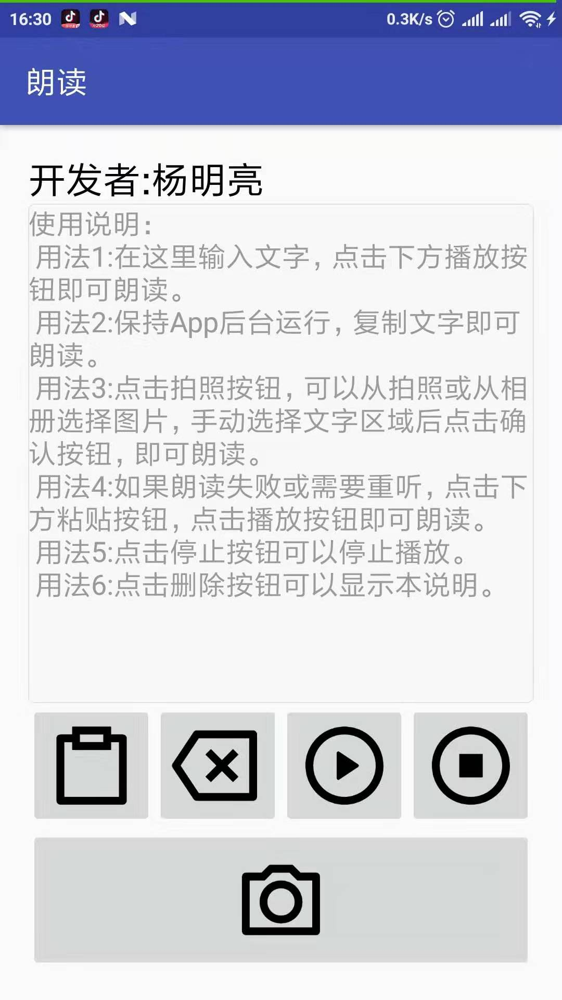
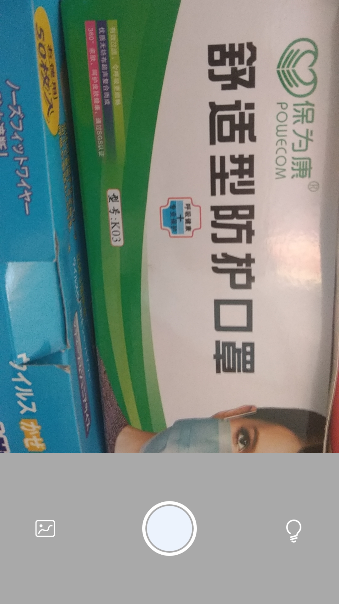
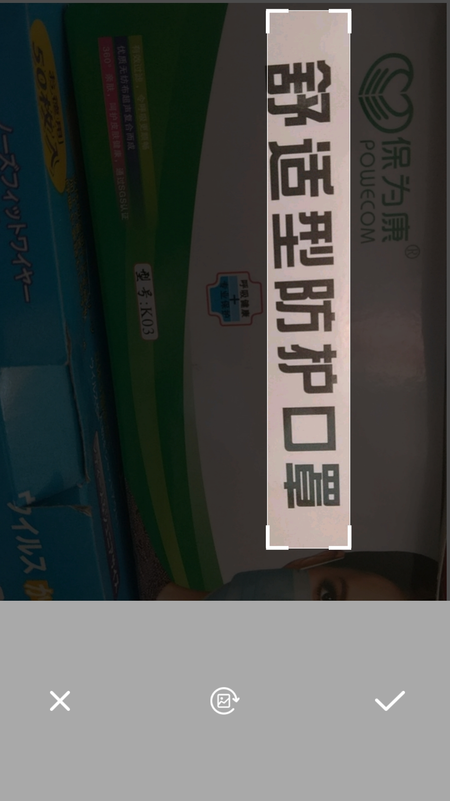
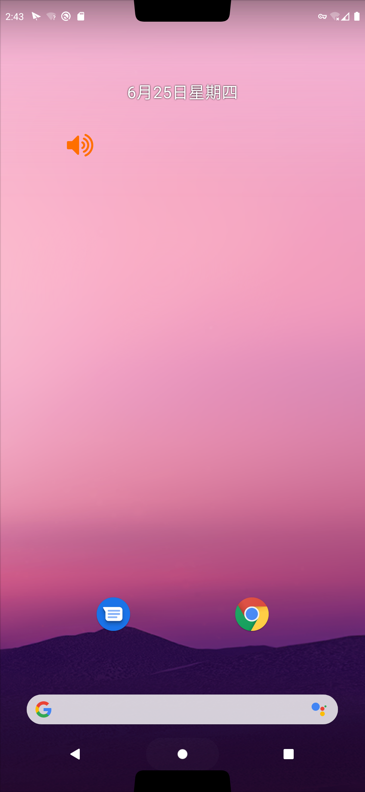

# textreader
为文盲人群朗读文本；也可以帮助TA们确认语音输入法输入的文字是否正确，达到朗读、输入文字的目的。

## 下载
[朗读V2.apk（任意机型都可用）](https://raw.githubusercontent.com/ymlgithub/textreader/master/app/release/%E6%9C%97%E8%AF%BBV2.apk)

[朗读_旧版.apk（Android 10以下机型可用）](https://raw.githubusercontent.com/ymlgithub/textreader/master/app/release/%E6%9C%97%E8%AF%BB_%E6%97%A7%E7%89%88.apk)

## 使用说明
### Android 10以下机型

### Android 10及以上机型

由于Android 10及以上机型无法后台监听剪贴板，因此相比Android 10以下机型新增全局可拖动的悬浮窗，复制文字后需要点击一下悬浮窗才能朗读。

## for 开发者

OCR部分采用[百度OCR服务](https://ai.baidu.com/ai-doc/OCR/ok3h7xx8c)，使用授权文件获得AccessToken。
1. 在[官网](https://console.bce.baidu.com/ai/?fromai=1&_=1488766023093#/ai/ocr/app/list)中配置应用  

2. 在***应用详情***页面下载对应应用的授权文件  

3. 将授权文件添加至工程assets文件夹，文件名必须为`aip.license`  

